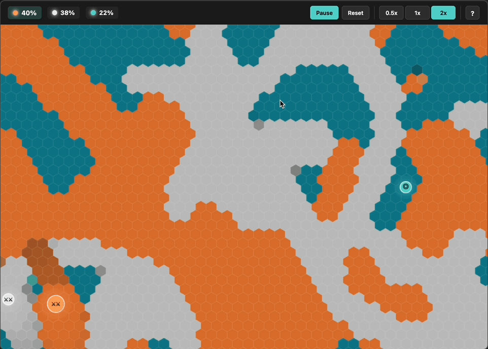

# Cellular Conquest

[](https://davidlampon.github.io/hex-cell-conquest/)
[](LICENSE)

> A mesmerizing three-way territorial battle simulation on a hexagonal grid, combining cellular automata with autonomous agent AI.



## 🎮 [Play Now](https://davidlampon.github.io/hex-cell-conquest/)

## ✨ Features

### Gameplay
- **Three-Way Territory Battle**: Watch Orange, Gray, and Cyan factions fight for dominance
- **Hexagonal Grid System**: 2000+ hex cells with cellular automata rules
- **Intelligent AI Agents**: Three autonomous "catalysts" with dynamic behavior modes
  - 🎯 **Hunt Mode** (◎): Actively seeking enemy territory
  - ⚔️ **Chase Mode** (⚔): Hunting prey in predator-prey chain
  - ⚠️ **Flee Mode** (⚠): Escaping from predators
  - ⚔⚔ **Gang Up Mode** (⚔⚔): Two stronger factions target the weakest
- **Predator-Prey Dynamics**: Orange > Gray > Cyan > Orange
- **Kill Streak System**:
  - Double Kill: +30% speed boost with enhanced glow
  - Triple Kill: +20% size increase with massive aura
  - Dominating: All bonuses stacked
- **Last Stand Comeback**: Berserker mode at <15% territory (2x speed, 2x impact, can kill any color)
- **Territory-Based Power Scaling**: Leaders get stronger, weak factions get penalties
- **Dynamic Respawn Delays**: Losing factions stay dead longer
- **Audio Feedback**: Kill sounds, death explosions, epic kill streak chords
- **Visual Announcements**: Large on-screen text for major events
- **Real-Time Territory Stats**: Live percentage tracking with elimination at 5%
- **Particle Effects**: Visual feedback on collisions and deaths
- **Smooth Animations**: Color transitions, cell strength indicators, pulsing auras

### Controls
- **Pause/Resume**: Space bar or button click
- **Reset**: R key or button click
- **Speed Control**: Adjust simulation speed (0.5x, 1x, 2x)
  - Press `1` for slow motion
  - Press `2` for normal speed
  - Press `3` for fast forward

## 🏗️ Architecture

The project is built with clean, modular JavaScript using ES6 modules:

```
hex-cell-conquest/
├── index.html          # Main HTML structure
├── styles.css          # All styling and responsive design
├── demo.gif            # Gameplay demonstration
├── js/
│   ├── config.js       # Game constants and configuration
│   ├── game.js         # Main game controller and animation loop
│   ├── grid.js         # HexGrid class - hexagonal grid system
│   ├── catalyst.js     # Catalyst class - AI agent behavior
│   ├── renderer.js     # Renderer class - canvas drawing
│   ├── audio.js        # AudioSystem class - Web Audio API sounds
│   └── ui.js           # UIController class - controls & stats
└── README.md
```

### Key Modules

**`config.js`** - Centralized configuration
- Canvas dimensions, hex geometry
- Color palette definitions
- AI behavior parameters
- Game balance tuning values

**`grid.js`** - Hexagonal Grid System
- Manages hex cell states (color, strength, transitions)
- Implements cellular automata rules
- Handles neighbor calculations with even/odd row offsets
- Calculates territory statistics

**`catalyst.js`** - Agent AI & Physics
- Predator-prey behavior (Orange > Gray > Cyan > Orange)
- Gang-up strategy targeting weakest faction
- Kill streak tracking and bonuses
- Last Stand berserker mode
- Force-based movement with smart target acquisition
- Collision detection with lethal kills
- Territory conversion on contact
- Dynamic respawn delays based on territory

**`renderer.js`** - Canvas Rendering
- Hexagon drawing with strength-based alpha
- Smooth color transition effects
- Dynamic catalyst sizing based on power
- Kill streak visual effects (enhanced glow, size increase)
- Last Stand red pulsing aura
- Particle system for collision and death effects
- On-screen announcements with fade in/out

**`audio.js`** - Sound System
- Web Audio API for procedural sound generation
- Kill sounds (descending tones)
- Death explosions (noise bursts)
- Kill streak chords (Double/Triple/Dominating)
- Last Stand dramatic tones
- Collision beeps
- Master volume control

**`ui.js`** - User Interface
- Event handling for buttons and keyboard
- Real-time territory percentage updates
- Visual feedback for leading faction
- Speed control state management

**`game.js`** - Main Controller
- Animation loop coordination
- Game state management
- Kill streak and announcement handling
- Audio integration
- Update scheduling (grid updates every 5 frames)
- Speed multiplier implementation
- Territory-based elimination checks

## 🎯 Game Mechanics

### Cellular Automata Rules
Each hex cell has:
- **Color**: Faction (0=Orange, 1=Gray, 2=Cyan)
- **Strength**: 0-5 (determines resilience)

Cells strengthen when surrounded by allies, weaken when outnumbered by enemies. When strength reaches 0, the cell flips to the dominant enemy color.

### Catalyst AI Behavior
Catalysts use sophisticated multi-layered AI:

1. **Predator-Prey Chain**
   - Orange hunts Gray, Gray hunts Cyan, Cyan hunts Orange
   - Catalysts flee from predators and chase prey
   - Hunters get 40% speed boost when chasing

2. **Gang Up Strategy**
   - When all 3 alive, two stronger factions target weakest (>10% gap)
   - 3x priority for weakest faction's territory
   - Overrides flee behavior for strategic aggression

3. **Territory-Based Power Scaling**
   - **>40% territory**: +20% speed, +50% impact radius (dominant)
   - **<30% territory**: -10% speed (struggling)
   - Creates snowball effect for victories

4. **Kill Streak Bonuses**
   - **Double Kill** (2): +30% speed for 10 sec
   - **Triple Kill** (3): +20% size increase
   - **Dominating** (4+): All bonuses stack
   - 5-second window to chain kills

5. **Last Stand Mode**
   - Triggers at <15% territory
   - 2x speed, 2x impact radius
   - Can kill ANY color (ignores predator-prey)
   - 20 seconds before forced elimination
   - Red pulsing aura

6. **Dynamic Respawn**
   - Base: 5 seconds
   - Weak territories (<30%): up to 15 seconds
   - Gives winners time to capitalize

7. **Target Acquisition**
   - Samples 20 random grid positions
   - Prioritizes dead enemy territory (2x)
   - Scores based on weakness, borders, distance
   - Reacquires with 3% probability per frame

8. **Movement Physics**
   - Max speed: 4.5 px/frame (scales with territory)
   - Boundary collision with damping (90% velocity retention)
   - Lethal collisions when hunting prey

9. **Territory Impact**
   - Converts cells within impact radius (scales with power)
   - Sets converted cells to maximum strength
   - Dominant factions paint 50% larger area

### Victory Conditions
- Reduce enemy to <5% territory for elimination
- Last faction standing wins
- Typical game: 5-8 minutes

## 🚀 Development

### Running Locally
```bash
# Clone the repository
git clone https://github.com/davidlampon/hex-cell-conquest.git

# Navigate to directory
cd hex-cell-conquest

# Serve with any static server (e.g., Python)
python -m http.server 8000

# Or use Node.js http-server
npx http-server

# Open http://localhost:8000
```

### Project Structure
No build tools required! Pure vanilla JavaScript with ES6 modules. Just open `index.html` in a modern browser or use a static server.

### Modifying Game Parameters
Edit `js/config.js` to customize:
- Grid density (`hex.radius`)
- AI aggression (`catalyst.attractionStrength`, `repulsionStrength`)
- Agent speed (`catalyst.maxSpeed`)
- Territory conversion rate (`grid.strengthDecayRate`, `strengthGrowthRate`)
- Color palette (`colors` array)

## 🎨 Customization Examples

### Change Colors
```javascript
// In js/config.js
colors: [
    { light: '#FF6B6B', dark: '#C92A2A', name: 'Red' },
    { light: '#51CF66', dark: '#2F9E44', name: 'Green' },
    { light: '#339AF0', dark: '#1864AB', name: 'Blue' }
]
```

### Adjust AI Behavior
```javascript
// In js/config.js
catalyst: {
    maxSpeed: 5.0,              // Faster agents
    attractionStrength: 0.1,    // More aggressive
    repulsionDistance: 150      // Larger personal space
}
```

### Modify Grid Dynamics
```javascript
// In js/config.js
grid: {
    updateInterval: 3,           // Faster territory spread
    strengthDecayRate: 0.5,      // Weaken faster
    strengthGrowthRate: 0.3      // Strengthen faster
}
```

## 📊 Performance

- **Grid Size**: ~1900 cells (38 cols × 50 rows)
- **Frame Rate**: 60 FPS on modern browsers
- **Update Cycle**: Grid updates every 5 frames for optimization
- **Particle System**: Dynamic particle pool with automatic cleanup

## 🤝 Contributing

Contributions welcome! Areas for improvement:
- [ ] Mobile touch controls
- [ ] WebGL renderer for larger grids
- [ ] Save/load game states
- [ ] Replay system
- [ ] Sound effects
- [ ] Multiple game modes
- [ ] Configurable grid sizes

## 📝 License

MIT License - feel free to use this project for learning or building upon!

## 🙏 Acknowledgments

Inspired by:
- Conway's Game of Life (cellular automata)
- Boids algorithm (flocking behavior)
- Territory control games

## 🔗 Links

- **Live Demo**: https://davidlampon.github.io/hex-cell-conquest/
- **GitHub**: https://github.com/davidlampon/hex-cell-conquest
- **Issues**: https://github.com/davidlampon/hex-cell-conquest/issues

---

Made with ❤️ using vanilla JavaScript and HTML5 Canvas